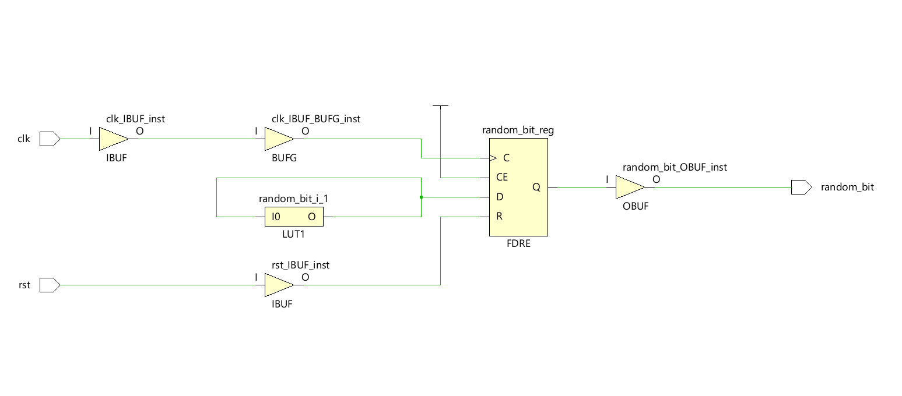
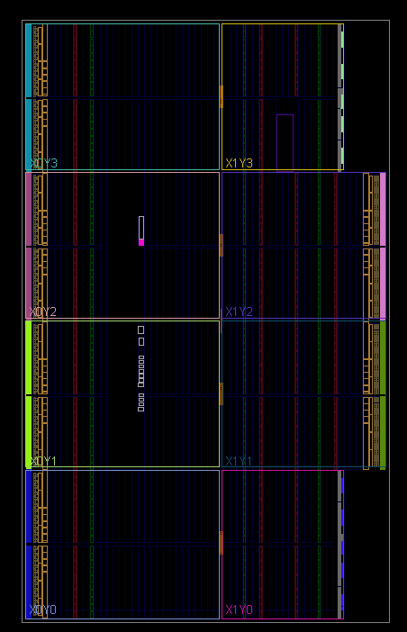
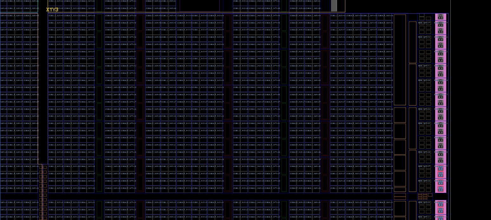

# Interactive CMOS-Based TRNG Block with Co-Simulation Testbench

This repository contains a fully verified **True Random Number Generator (TRNG)** core modeled with Verilog, driven and tested via an interactive co-simulation framework using **CoCoTb** and **Tkinter GUI**.

The design addresses a common pitfall in digital hardware simulators (like Icarus Verilog): the inability to model raw analog thermal noise in an ideal ring oscillator loop. By injecting controlled propagation delays and synthesis-friendly meta-stability emulation, this core achieves stable, free-running oscillation suitable for hardware random bit generation.

---

## 🛠️ System Architecture & RTL Design

The hardware block consists of a multi-stage ring oscillator whose output is sampled on the rising edge of the system clock. 

### RTL Schematic
Below is the synthesized RTL schematic generated from the Verilog source. The synthesis engine maps the oscillator and feedback loop directly onto an optimized Look-Up Table (**LUT1**) which feeds the data pin (D) of a Flip-Flop with Clock Enable and Synchronous Reset (**FDRE**).



### FPGA Floorplanning & Implementation
The following views showcase the physical implementation layout and routing resources utilized on the target FPGA die fabric (slices, routing matrices, and I/O buffers):

| Device Floorplan | Routing & Logic Slice Placement |
| :---: | :---: |
|  |  |

---

## 🚀 Co-Simulation Framework

Instead of relying on rigid, hardcoded test vectors, the verification layer uses an advanced event-driven co-simulation loop:

* **Hardware Verification Engine:** CoCoTb (Python-based HDL verification framework).
* **Simulator:** Icarus Verilog (`iverilog`).
* **Control UI:** A non-blocking Tkinter-based Graphical User Interface that allows the developer to toggle system reset states and control a free-running clock directly in the simulation time wheel.

### Key Implementation Details
To ensure fluid UI responsiveness without stalling or crashing the underlying discrete-event simulator, the Python UI update routine (`root.update()`) is synchronized with precise delta-cycle time steps via CoCoTb's `Timer(10, unit="ns")` scheduler.

---

## 🔭 Roadmap
- [ ] Statistical validation via NIST SP 800-22 test suite
- [ ] Von Neumann bias correction / post-processing
- [ ] Shift register-based byte packing
- [ ] UART interface for external bit streaming
- [ ] Target FPGA board synthesis & on-hardware validation

---

## 📦 Project Directory Structure

```text
.
├── README.md           # Documentation
├── assets/             # Implementation & Schematic Images
│   ├── rtl_schematic.png
│   ├── synth_design_1.png
│   └── synth_design_2.png
├── sim/                # Verification / Simulation Layer
│   ├── runner.py       # CoCoTb execution entry point
│   └── testbench.py    # Tkinter GUI & Async verification loop
└── src/                # RTL Source Files
    ├── cmos_not.v      # Behavioral delay-inverter block
    ├── ring_osc.v      # Multi-stage ring oscillator wire-mesh
    └── top_module.v    # Top hardware layer (Sampling & Sync Reset)
